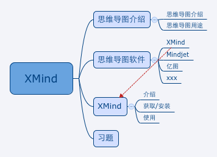

# XMind

XMind 是一款专注于思维导图制作的软件。

## 什么是思维导图

思维导图，又称心智图、脑图、是以图形化的方式来发散和表达思维的一种工具。

它使用图像式的表达方式，把思维和事物所包含的种种按照一定的逻辑、分类，层级关系在图形中展现，从而使思维或事物更加的清晰，进而发散更多的想法。

## 思维导图有哪些应用

稍微夸张的说，思维导图可以应用到所有事物及工作中，只要宇宙中存在的东西，都有用思维导图表达的可能性。比如这篇文章，在创作前我可以先用思维导图构思一下文章需要包含哪些内容，又有哪些主干，哪些分支，这些主干和分支有分别是如何组合组织的，这样，一副关于这篇文章的思维导图就出来了：

## 思维导图软件

## XMind 介绍

## 获取/安装 XMind

## 使用 XMind
